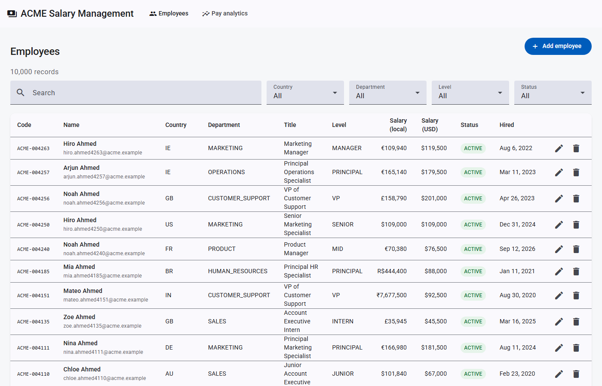
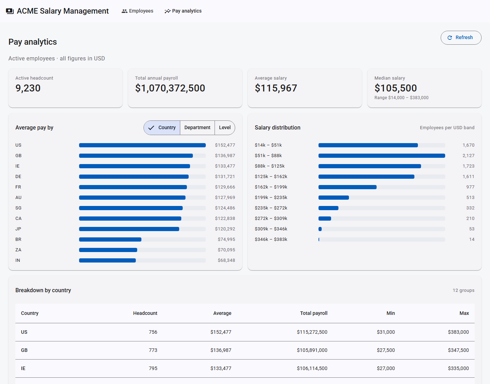

# ACME Salary Management

[](https://github.com/haswanthmeenugu-create/Practice_Assessment/actions/workflows/ci.yml)

Web application for an HR Manager to manage salary data for ~10,000 employees
across multiple countries and answer the question **"how does the org pay
people?"** — replacing a spreadsheet-based workflow.

Built for the *Assessment with Product Framing* take-home.

| | |
|---|---|
| Backend | Java 21 bytecode (built on JDK 25), Spring Boot 3.3, Spring Data JPA |
| Database | MySQL 8 at runtime · H2 in-memory for tests and the `demo` profile |
| Frontend | Angular 18 (standalone components), Angular Material |
| Seed | 10,000 deterministic employees, loaded on first start in ~1 second |
| Tests | 30 backend (JUnit 5, H2) + 10 frontend (Karma/Jasmine), run in CI |

## Screenshots

| Employees — server-side search, filters, paging, CRUD | Pay analytics — KPIs, breakdowns, distribution |
|---|---|
|  |  |

## Artifacts (read these first)

- [docs/REQUIREMENTS.md](docs/REQUIREMENTS.md) — goal, scope, deliberate exclusions with reasoning. Written and committed **before** any code.
- [docs/ARCHITECTURE.md](docs/ARCHITECTURE.md) — layering, eight key trade-offs, performance at 10k rows, testing strategy, what I'd do next.
- [docs/AI-USAGE.md](docs/AI-USAGE.md) — how AI tools were directed, representative prompts, where human judgment changed the outcome, and the verification loop.
- `git log` — incremental commits, one layer at a time, showing how the solution evolved.

## Quick start (no database needed)

```powershell
# Terminal 1 — backend on in-memory H2 with 10,000 seeded employees
cd backend
mvn spring-boot:run -Dspring-boot.run.profiles=demo

# Terminal 2 — frontend
cd frontend
npm install
npm start
```

Open http://localhost:4200. API docs at http://localhost:8080/swagger-ui.html.

## Running against MySQL

MySQL 8 on `localhost:3306`. The app creates the `salary_management` database
and schema on first start and seeds 10,000 employees if the table is empty.
Credentials come from the environment; nothing secret is committed.

```powershell
$env:DB_USERNAME = "root"
$env:DB_PASSWORD = "<your mysql password>"
# optional: $env:DB_URL = "jdbc:mysql://host:3306/salary_management?createDatabaseIfNotExist=true&serverTimezone=UTC"

cd backend
mvn spring-boot:run
```

Seeding is controlled by `app.seed.enabled` and `app.seed.count` in
`backend/src/main/resources/application.properties`.

## Tests

```powershell
cd backend
mvn test           # 30 tests · H2 in-memory · no MySQL needed · ~20 s

cd frontend
npm test           # 10 tests · headless Chrome
```

Both suites plus a production frontend build run on every push via
[GitHub Actions](.github/workflows/ci.yml).

## API at a glance

| Method | Path | Purpose |
|---|---|---|
| GET | `/api/employees?q=&country=&department=&level=&status=&page=&size=&sort=&direction=` | Paginated, filtered search (page size capped at 100) |
| GET | `/api/employees/{id}` | Fetch one |
| POST | `/api/employees` | Create — server assigns `ACME-######` code, returns 201 + Location |
| PUT | `/api/employees/{id}` | Update |
| DELETE | `/api/employees/{id}` | Delete (204) |
| GET | `/api/analytics/overview` | Active headcount, total payroll, avg / median / min / max |
| GET | `/api/analytics/by/{country\|department\|level}` | Pay breakdown by dimension |
| GET | `/api/analytics/distribution` | Salary histogram |

All analytics figures are normalized to USD via a static FX table so
cross-country comparisons are meaningful. Errors return a consistent JSON
shape (`status`, `error`, `message`), with field-level detail on validation
failures.

## Project layout

```
backend/
  src/main/java/com/acme/salary/
    web/          REST controllers, DTOs, error handling
    service/      business rules, analytics orchestration
    analytics/    pure statistics (median, histogram)
    money/        CurrencyConverter + static-rate implementation
    repository/   Spring Data JPA, specifications, GROUP BY projections
    domain/       Employee entity + enums
    seed/         deterministic generator + JDBC batch loader
  src/test/java/  unit, JPA-slice, and full-stack API tests
frontend/
  src/app/
    employees/    table, filters, create/edit dialog
    analytics/    dashboard
    core/         typed API clients, models, error interceptor
    shared/       bar chart, confirm dialog
docs/             requirements, architecture, AI usage, screenshots
.github/          CI workflow
```
